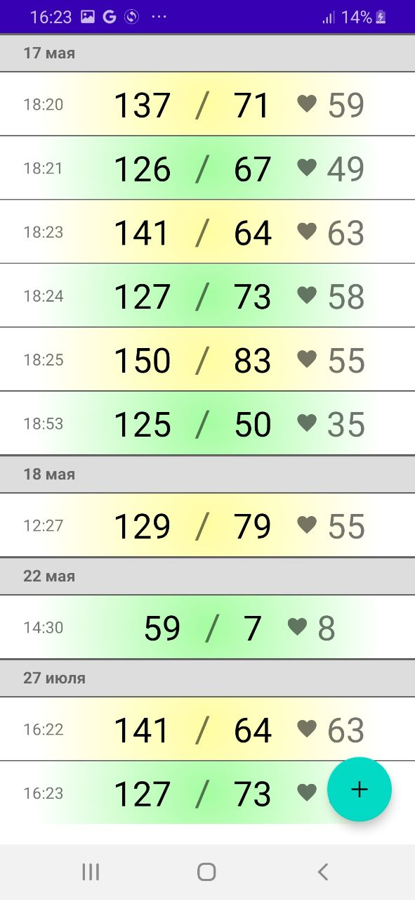
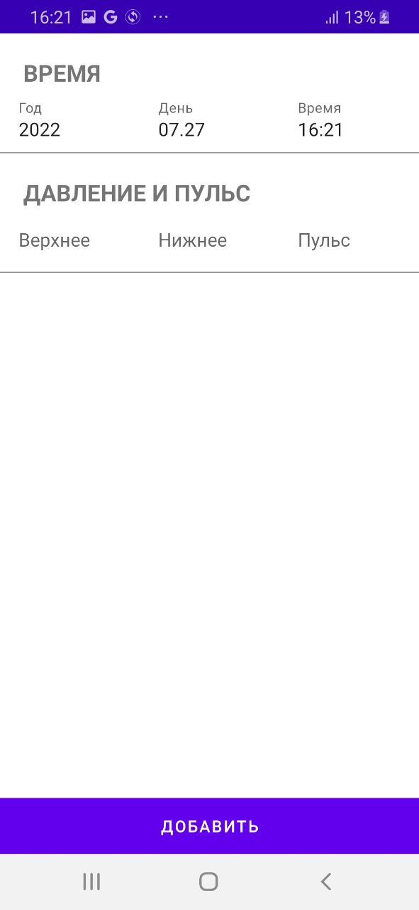
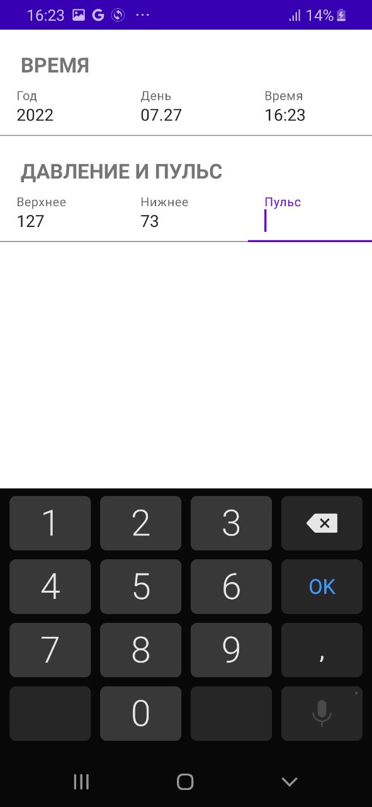

<b>
  

    Стек технологий: FirebaseFirestore, Koin, ViewModel, Fragments.
  

  

    Навигация между экранами: Cicerone
  

</b>
Пример приложения, использующего Firebase Cloud Firestore. Состоит
из основного экрана с журналом замеров давления и пульса, а также
экрана для создания записей в журнале. Журнал синхронизируется с
коллекцией в базе данных Cloud Firestore.
Приложение реализует архитектуру MVVM с соблюдением принципов
SOLID, Clean Architecture, Single Activity.

  
  
  

